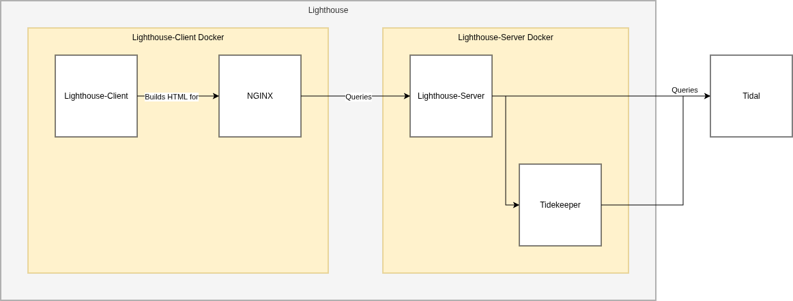

# Project Overview
## Overview
Lighthouse is intended to be a monolithic service where each sub-system has a uni-directional control interface to the next service.

In other words, each sub-system is only capable of invoking the services downstream of it. I.e: Lighthouse-Client can invoke Lighthouse-Server but Lighthouse-Server can not invoke Lighthouse-Client.



!!! note
    When Lighthouse is ran using the recommended Docker setup NGINX is used to provide a web server for Lighthouse-Client. When Lighthouse is ran without Docker Lighthouse-Client communicates directly with Lighthouse-Server.  

## Lighthouse-Client
The architecture for Lighthouse-Client is yet to be finalised but is largely designed around exposing Lighthouse-Server's API in a logical manner.

The core UI framework for Lighthouse-Client revolves around using ```go_router``` and ```lib/components/responsive_scaffold.dart``` to provide a responsive Material design with 3 core navigation destinations: "Search", "Tasks", and "Settings" (available in ```lib/pages/core```). Additional routes are available for connecting to a Lighthouse-Server server and for configuring the user tokens for Lighthouse-Server and Tidekeeer (available in ```/lib/pages/auxiliary```).

- Search: exposes information available for each artist from Lighthouse-Server. Artists can be selected to get detailed information and to perform artist-specific tasks.
- Tasks: recent 'tasks' that Lighthouse-Server has ran or is running. This includes the basic details about and stdout for each task.
- Settings: system health information and key system functions

## Lighthouse-Server
The architecture for Lighthouse-Server is mostly finalised and revolves around the entrypoint ```__main__.py``` defining the web-accessible routes which commonly call ```LighthouseAPI()``` from ```lighthouse_api.py``` to perform a given task. Most ```LighthouseAPI()``` functions call ```TidalAPI()``` and/or  ```TidekeeperAPI()``` from ```tidal_api.py``` and ```tidekeeper_api.py``` respectively to get information and media from Tidal.
