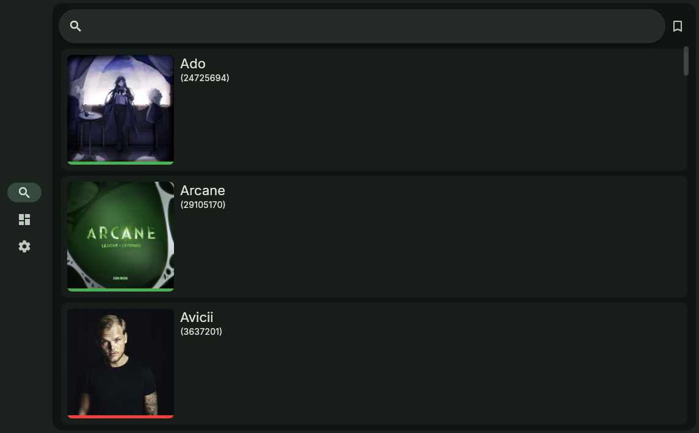
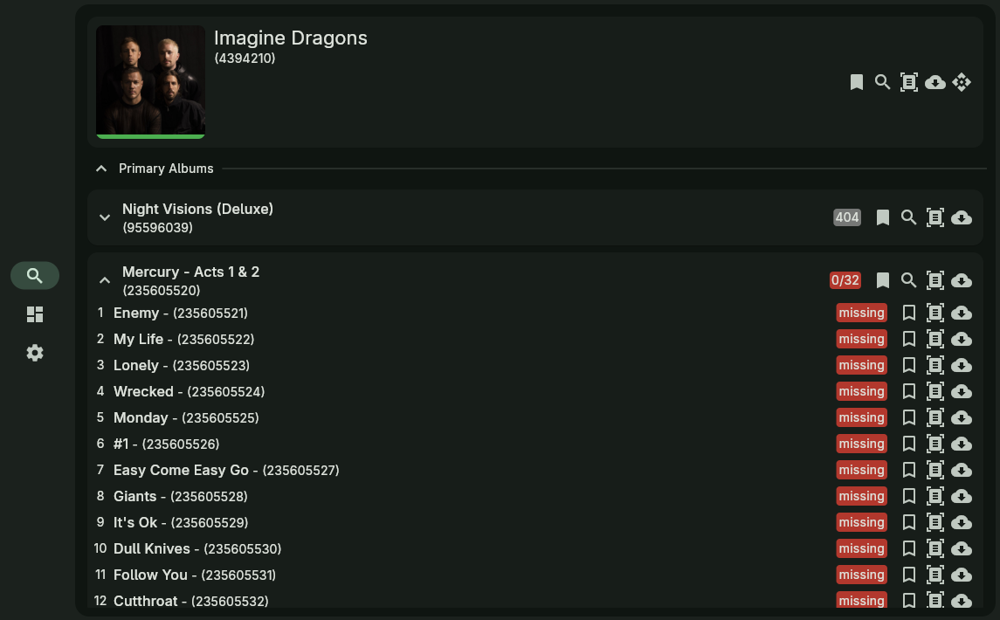
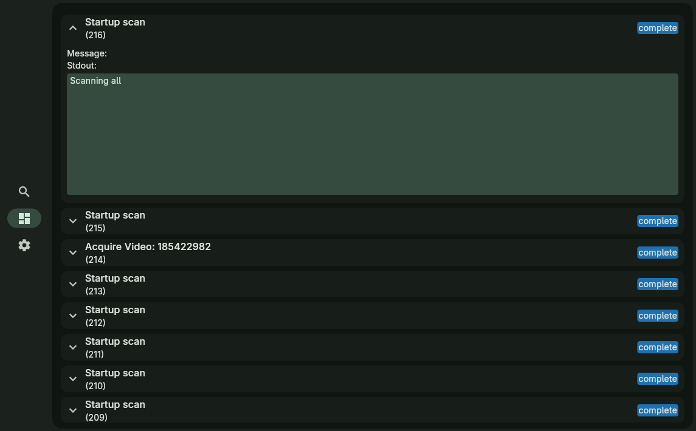
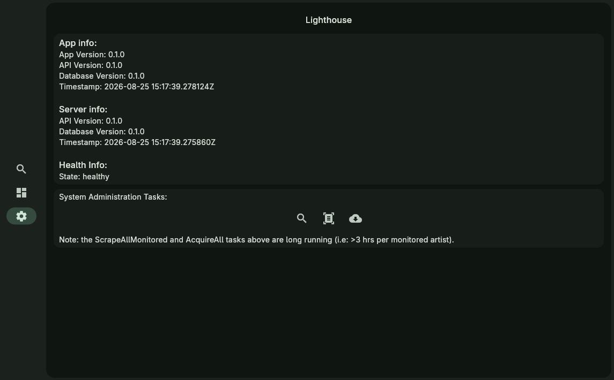

# Usage
## Overview
After connecting Lighthouse-Client to a Lighthouse-Server you should be greeted with a user interface that looks something like:

By default Lighthouse starts on the search screen but the three navigation buttons a user to navigate between:

- Search: used for finding artists
- Tasks: used for understanding the state of any actions started. The log for each action can be read by expanding the task.
- Settings: used for understanding system health and performing system wide tasks

## Search
By default the search screen will be mostly empty with a filled 'bookmark' icon in the bottom left.

Whilst the bookmark icon is filled using the search bar will only show 'monitored' artists. Click on the bookmark to toggle it.

To start toggle the bookmark off and type in the name of an artist you like. Generally speaking, the first time you search for an artist it will be quite slow but once loaded into the database it should be much quicker. Some results should eventually appear.

Clicking on an artist will take you to their page:

You'll probably find the artists image has a red line underneath it and their albums and videos are empty. Click on the bookmark to 'monitor' the artist (which will recursively apply to any albums/videos/track) that is found during scraping and the line should turn green.

The four remaining buttons on the artist header are:

- Scrape: the process of scraping Tidal's API for information about the artists (i.e: albums, tracks, videos, etc)
- Scan: the process of checking locally available media to see what is already downloaded
- Acquire: the process of downloading each track/video via Tidekeeper into local storage
- Scrape and Acquire: automatically scrapes the artist and acquires everything that is monitored.

These buttons are also used for:

- Albums
- Videos
- Tracks

!!! warning
    Because each item needs to be scraped from Tidal it is not unusual for scrape and acquire 'tasks' to take a substantial time period. After starting a task you should be able to view it and it's status/stdout at the bottom of the page in the 'Recent Tasks' section.

!!! note
    Scraping and scanning generally does not require an artist to be monitored. Media found during scraping however will be marked as monitored if it's parent artist/album is monitored - it's a good idea to set it before scraping if desired.

!!! note
    At the bottom of the artist page there is a task log. This can be useful if you want to see the state of any ongoing tasks: especially since tasks can last multiple hours.

## Tasks
The task page looks like the following and will automatically update every few seconds:

## Settings
The settings page looks liek the following and will automatically update every few seconds:

!!! note
    The buttons on the settings page are broadly similar to the buttons on each artist's page but apply to every Monitored item. This means they will take a substantial time to complete.
